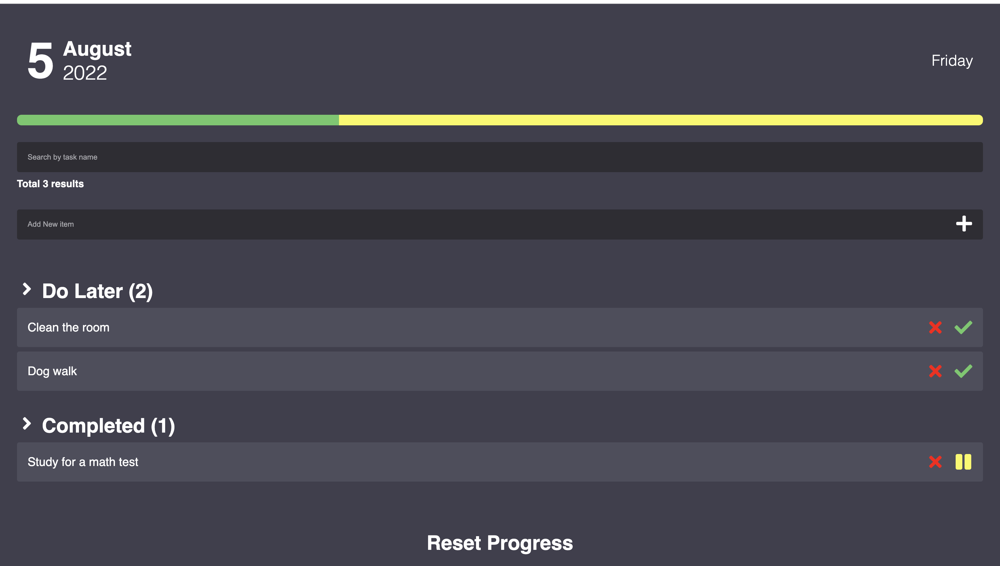
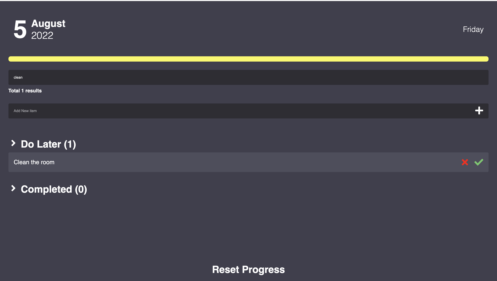
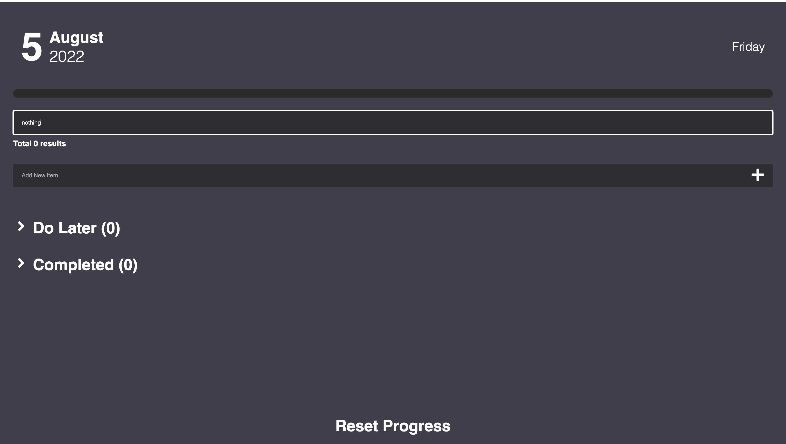
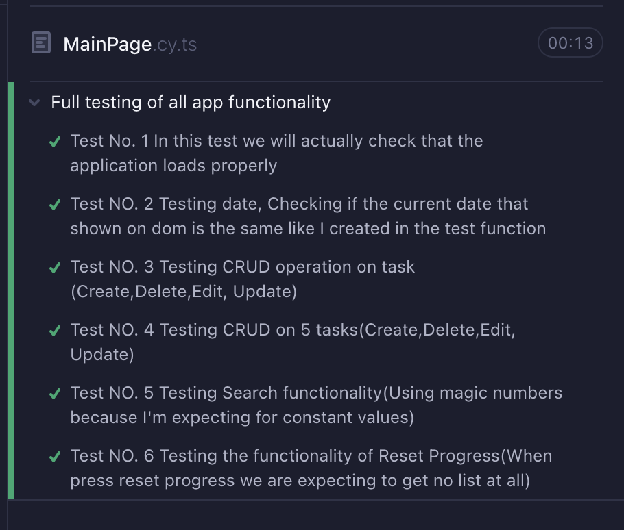
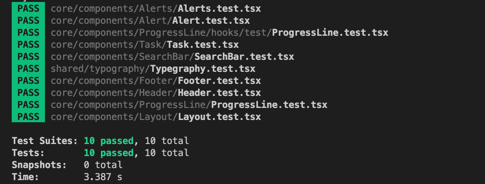

This is a [Next.js](https://nextjs.org/) project bootstrapped with [`create-next-app`](https://github.com/vercel/next.js/tree/canary/packages/create-next-app).

## A little about the project

Task management application - written in React with next.js.
Tests were written in jest and cypress.

This brunch uses AWS services.

Use of the following services:

API Gateway
DynamoDB
Lambda
IAM
CloudWatch

## Getting Started

First, run the development server:

```bash
npm run dev
# or
yarn dev
```

Open [http://localhost:3000](http://localhost:3000) with your browser to see the result.

## App example





## Cypress Test



## Jest Test


